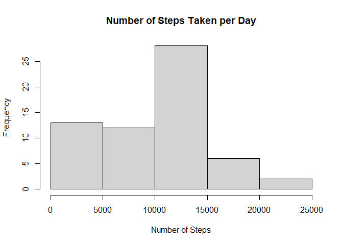
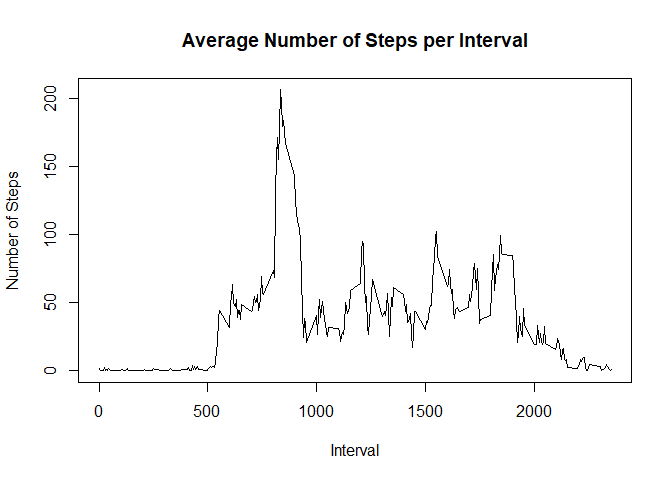
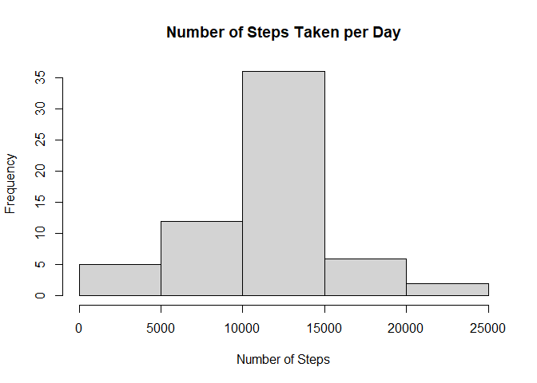
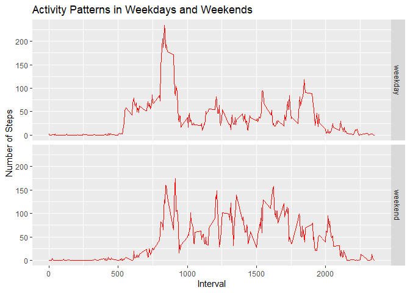

## Loading and preprocessing the data

First, we load the data and store it in a variable called activity:


```r
activity <- read.csv("activity.csv")
head(activity)
```

```
##   steps       date interval
## 1    NA 2012-10-01        0
## 2    NA 2012-10-01        5
## 3    NA 2012-10-01       10
## 4    NA 2012-10-01       15
## 5    NA 2012-10-01       20
## 6    NA 2012-10-01       25
```

We also load the dplyr package to be able to perform the analyses needed:


```r
library(dplyr)
```

```
## 
## Attaching package: 'dplyr'
```

```
## The following objects are masked from 'package:stats':
## 
##     filter, lag
```

```
## The following objects are masked from 'package:base':
## 
##     intersect, setdiff, setequal, union
```

## What is mean total number of steps taken per day?

To get the total number of steps for each day, we must first make a subset of 
data that collects this information:


```r
dailyTotalSteps <- activity %>% group_by(date) %>% 
    summarize(totalSteps = sum(steps, na.rm=TRUE))
```

```
## `summarise()` ungrouping output (override with `.groups` argument)
```

```r
head(dailyTotalSteps)
```

```
## # A tibble: 6 x 2
##   date       totalSteps
##   <chr>           <int>
## 1 2012-10-01          0
## 2 2012-10-02        126
## 3 2012-10-03      11352
## 4 2012-10-04      12116
## 5 2012-10-05      13294
## 6 2012-10-06      15420
```

We then use the following code to construct a histogram that shows the 
frequencies of the different total numbers of steps taken per day:


```r
hist(dailyTotalSteps$totalSteps, xlab="Number of Steps",
    main="Number of Steps Taken per Day")
```

<!-- -->

We then get the mean of the total numbers of steps:


```r
mean(dailyTotalSteps$totalSteps)
```

```
## [1] 9354.23
```

We can also compute the median total number of steps using the code below:


```r
median(dailyTotalSteps$totalSteps)
```

```
## [1] 10395
```

## What is the average daily activity pattern?

First, we create a data subset that gets the average number of steps per 
interval:


```r
avgStepsInterval <- activity %>% group_by(interval) %>% 
    summarize(avgSteps = mean(steps, na.rm=TRUE))
```

```
## `summarise()` ungrouping output (override with `.groups` argument)
```

```r
head(avgStepsInterval)
```

```
## # A tibble: 6 x 2
##   interval avgSteps
##      <int>    <dbl>
## 1        0   1.72  
## 2        5   0.340 
## 3       10   0.132 
## 4       15   0.151 
## 5       20   0.0755
## 6       25   2.09
```

Next, we plot a time series plot between the 5-minute intervals and their 
corresponding average number of steps:


```r
with(avgStepsInterval, plot(interval, avgSteps, type="l", xlab="Interval",
    ylab="Number of Steps", main="Average Number of Steps per Interval"))
```

<!-- -->

We can then use the following code to see which interval had the largest number
of steps on average across all days:


```r
avgStepsInterval$interval[which(avgStepsInterval$avgSteps == 
                                  max(avgStepsInterval$avgSteps))]
```

```
## [1] 835
```

## Inputting missing values

First, we check how many rows in the original data set has missing values:


```r
sum(is.na(activity$steps))
```

```
## [1] 2304
```

We then use the following code to create a new data set that fills in the rows 
with missing values with the mean number of steps of their respective intervals:


```r
new_activity <- activity
intervals <- new_activity$interval[which(is.na(new_activity$steps))]
fill_values <- numeric()

for (i in intervals){
  fill_values <- c(fill_values,
                   avgStepsInterval$avgSteps[avgStepsInterval$interval == i])
}

new_activity$steps[which(is.na(new_activity$steps))] <- fill_values
```

To make sure that it works, we check that there are no more missing values in
the new data set:


```r
sum(is.na(new_activity$steps))
```

```
## [1] 0
```

We now make a histogram for the daily total number of steps:


```r
dailyTotalSteps <- new_activity %>% group_by(date) %>% 
    summarize(totalSteps = sum(steps, na.rm=TRUE))
```

```
## `summarise()` ungrouping output (override with `.groups` argument)
```

```r
hist(dailyTotalSteps$totalSteps, xlab="Number of Steps",
    main="Number of Steps Taken per Day")
```

<!-- -->

We also calculate the mean of the resulting data set:


```r
mean(dailyTotalSteps$totalSteps)
```

```
## [1] 10766.19
```

As well as the median:


```r
median(dailyTotalSteps$totalSteps)
```

```
## [1] 10766.19
```

We can see that filling in missing values impacts the distribution, the mean,
and the median of the data. The data appears to be more normally distributed, as
shown by the histogram and the fact that both the mean and the median of the new
data set are the same.

## Are there differences in activity patterns between weekdays and weekends?

To answer this question, we add a new column to the original data set that
classifies the date of the observations as being a weekday or a weekend. We then
store this in a variable named activityPattern:


```r
we <- c("Saturday","Sunday")

activityPattern <- activity %>% 
  mutate(weekday_weekend = 
           ifelse(weekdays(as.Date(date)) %in% we, "weekend", "weekday")) %>%
  group_by(weekday_weekend, interval) %>%
  summarize(avgSteps = mean(steps, na.rm=TRUE))
```

```
## `summarise()` regrouping output by 'weekday_weekend' (override with `.groups` argument)
```

```r
head(activityPattern)
```

```
## # A tibble: 6 x 3
## # Groups:   weekday_weekend [1]
##   weekday_weekend interval avgSteps
##   <chr>              <int>    <dbl>
## 1 weekday                0    2.33 
## 2 weekday                5    0.462
## 3 weekday               10    0.179
## 4 weekday               15    0.205
## 5 weekday               20    0.103
## 6 weekday               25    1.51
```

Next, using the ggplot2 plotting system, we show the activity patterns in both
weekdays and weekends to show the difference:


```r
library(ggplot2)

g <- ggplot(data=activityPattern, aes(interval, avgSteps)) 
g + geom_line(color="red") + facet_grid(weekday_weekend~.) + 
  labs(x="Interval", y="Number of Steps", 
       title="Activity Patterns in Weekdays and Weekends")
```

<!-- -->
